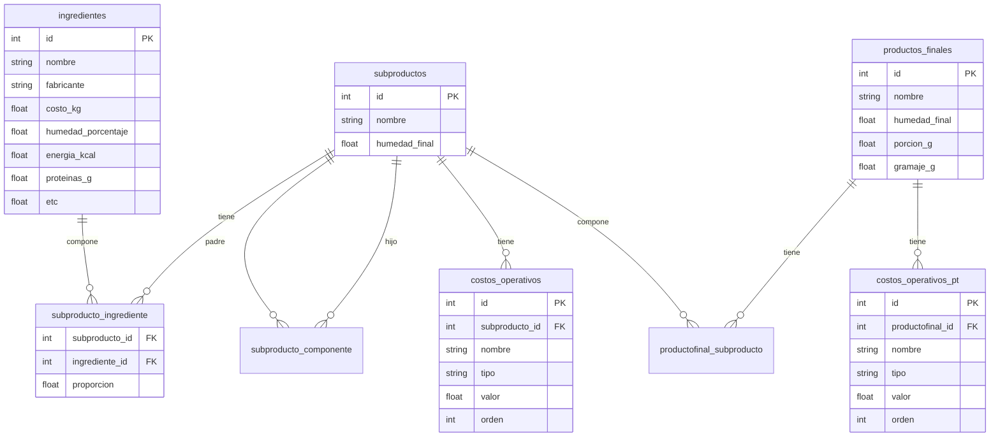

# Walkthrough: Modelos SubProducto y ProductoFinal (v2)

## Problema

Los modelos anteriores tenían una simplificación incorrecta de la matemática:
- La merma era un valor fijo guardado en la BD, pero en realidad **se calcula dinámicamente**
- Los costos eran un único campo `costo_operativo_kg`, pero en realidad son **una cascada secuencial** de pasos porcentuales y fijos

## Descubrimientos del Excel

Analicé la hoja **Extrusión** del Excel real y descubrí 5 reglas matemáticas exactas:

### Fórmula Nutricional

```
1. Suma lineal    = Σ (proporción_i × nutriente_i)      → Columna K del Excel
2. Humedad mezcla = Σ (proporción_i × humedad_i)        → K56
3. Merma          = humedad_mezcla − humedad_final       → G34
4. Factor         = 1 / (1 − merma)                      → Concentración
5. Nutriente      = suma_lineal × factor                  → Columna D
```

### Fórmula de Costos (Cascada)

```
Costo base = Σ (proporción_i × costo_kg_i)

Después, se aplican pasos secuenciales:
  - Porcentual: costo / (1 − valor)     ← ej. Tamizado pierde 1%
  - Fijo:       costo + valor           ← ej. Energía suma $200/kg
```

### Descubrimiento clave: PT Granel SÍ tiene concentración

El usuario dijo que "en la etapa final ya no hay mermas", pero el Excel muestra que **sí la hay**: `merma = 0.0648185` (≈6.5%). La fórmula es universal.

## Cambios realizados

### [MODIFY] [subproducto.py](file:///home/miauuu/Codigo/PROextrucion_tablas_nutricionales/src/models/subproducto.py)

| Antes | Después |
|---|---|
| `merma_humedad_porcentaje` (valor fijo) | `humedad_final` (fracción 0.0–1.0), merma se calcula dinámicamente |
| `costo_operativo_kg` (valor fijo único) | Tabla `CostoOperativo` con cascada secuencial (`tipo` + `valor` + `orden`) |
| `porcentaje_uso` (0–100) | `proporcion` (0.0–1.0) para coincidir con el Excel |

### [MODIFY] [producto_final.py](file:///home/miauuu/Codigo/PROextrucion_tablas_nutricionales/src/models/producto_final.py)

- Ahora tiene `humedad_final` y `merma()` igual que SubProducto
- Tiene su propia tabla `CostoOperativoPT` para la cascada de costos
- Misma fórmula de concentración

## Verificación contra el Excel

```
Nutriente                           Calculado          Excel   OK?
-----------------------------------------------------------------
energia_kcal                       383.676217     383.676217     ✅
proteinas_g                         10.493444      10.493444     ✅
grasa_total_g                        2.007768       2.007768     ✅
grasa_saturada_g                     0.218855       0.218855     ✅
carbohidratos_disp_g                78.030193      78.030193     ✅
azucares_totales_g                   4.508187       4.508187     ✅
fibra_dietetica_g                    3.484436       3.484436     ✅
sodio_mg                            16.367265      16.367265     ✅

Costo final/kg                    1222.084690    1222.084690     ✅
Merma                            0.0662765000   0.0662765000     ✅
```

**Todos los valores coinciden con el Excel al 100%.**

## Esquema de BD actualizado


